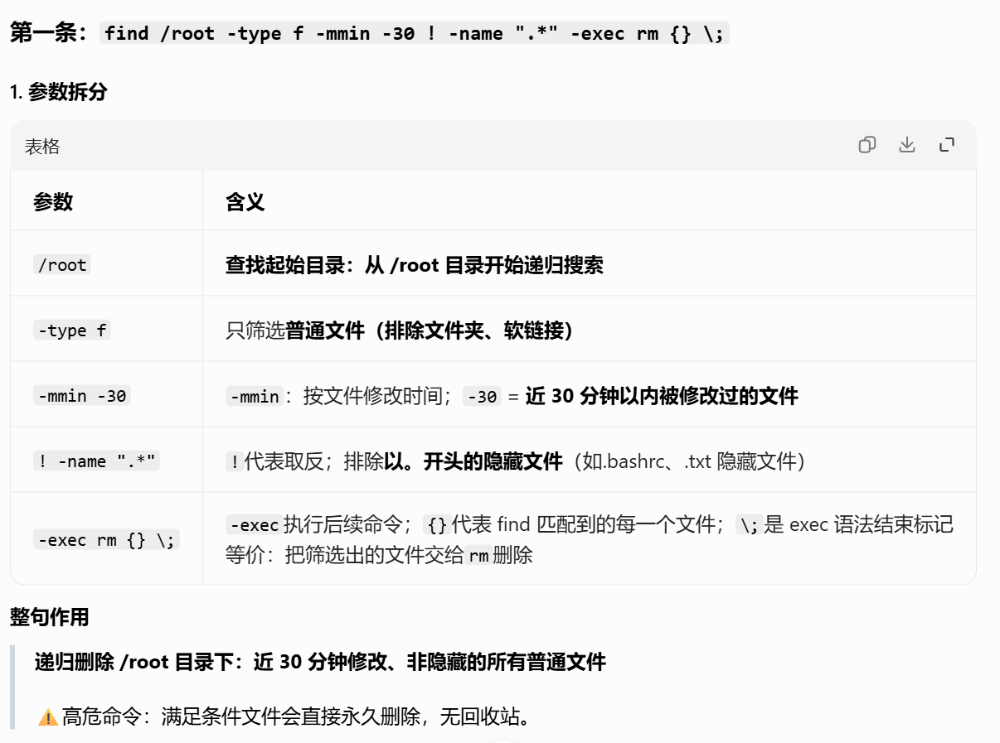
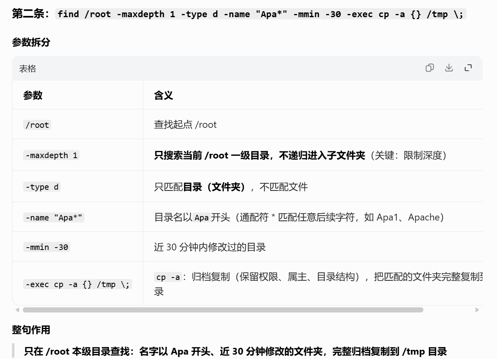

# 周五

# find 查找文件 + grep 过滤内容

## 一、find 查找文件

### 1. 在当前目录找所有 txt 文件

```
find . -name "*.txt"
```

### 2. 从根目录全盘找 sh 脚本

```
find / -name "*.sh"
```

### 3. 查找大于 10M 的文件

```
find / -size +10M
```

## 二、grep 过滤关键字

### 1. 在文件里过滤关键词

```
grep root /etc/passwd
```

### 2. 过滤不包含某关键词

```
grep -v root /etc/passwd
```

### 3. 忽略大小写匹配

```
grep -i system /etc/profile
```

### 4. 结合管道 | 使用（工作最常用）

```
ls -l | grep txt
ps -ef | grep nginx
```

## 今日必做实操作业

1. 用 `find` 在全盘找 `.log` 结尾的文件
2. 用 `grep` 在 `/etc/profile` 里过滤 **path** 关键字
3. 练习管道用法：查看进程过滤关键字


## 拓展：find文件查找

```shell
#文件查找
例子1：普通查询
find   /etc    -maxdepth 1  -type f  -name "pa*"
命令   目录...   查找深度      类型      文件名称
```


```shell
例子2：
忽略大小写查询
find /etc -maxdepth 1    -iname "pa*"
```


```shell
例子3：
根据修改时间查找文件
#时间单位为天
find /opt -type f -mtime -1   #-1代表一天以内，+1一天以前
#时间单位为分钟
[root@localhost ~]# find /root -type f -mmin -20
/root/.bash_history
/root/ReadMe.txt
/root/.lesshst
```

```shell
atime：最后访问时间
mtime：文件内容修改时间
ctime：文件属性修改时间
```


```shell
例子5：
对找出的文件进行处理
find /root -type f -mmin -30  ! -name ".*"  -exec rm {} \;
find /root  -maxdepth 1  -type d  -name "Apa*"   -mmin -30 -exec cp -a {} /tmp \;
```




