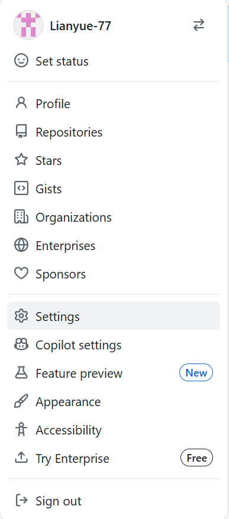
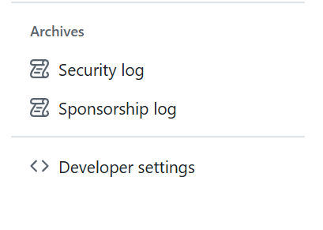

# 周日

# 练习与复习

## 一、今天要做的 3 件事

1. 把本周所有命令**从头到尾手动再敲一遍**
2. 自己做一遍综合实操小练习
3. 简单整理笔记，准备上传 GitHub

## 二、本周所有核心命令 完整复盘清单

你按顺序逐条敲一遍：

```
pwd  ls  cd  mkdir  mkdir -p  rmdir
touch  cp  mv  rm  rm -rf
cat  more  less  head  tail  tail -f
find  grep  | 管道用法
tar  zip  unzip
```

## 三、综合实操小任务（必做，自测有没有学会）

你独立完成，不看之前教程：

1. 在家目录创建层级目录：

```
project/ops/shell
```

1. 在 shell 里面 创建 3 个文件：

```
a.txt  b.log  c.sh
```

1. 复制 a.txt 备份为 a_bak.txt
2. 把 b.log 移动到 project/ops 目录
3. 查看 c.sh 前 5 行内容
4. 全盘查找后缀 `.sh` 的文件
5. 在 /etc/profile 中过滤关键字 `PATH`
6. 把整个 project 目录 打包压缩为：`project.tar.gz`
7. 把压缩包解压到 /tmp 目录


## 拓展

使用git上传笔记

**在你的学习文件夹空白处右键 → Git Bash Here**，直接进入当前目录终端。

**全局配置（首次只用一次）**

```
# 换成你的Github用户名、注册邮箱
git config --global user.name "Github用户名"
git config --global user.email "注册邮箱"
```

**网页 Github 新建空仓库**

右上角 +→New repository，**不要勾选 Initialize with README**，创建后复制 HTTPS 链接：

```
https://github.com/用户名/仓库名.git
#例如
https://github.com/Lianyue-77/Linux-Ops-Auto-Project.git
```

**Git Bash 内执行上传 5 条命令**

```
#1.初始化本地仓库
git init
#2.全部文件加入暂存
git add .
#3.提交本地版本（引号内写备注）
git commit -m "上传Windows运维学习资料"
#4.关联远程仓库（粘贴刚才复制的链接）
git remote add origin https://github.com/xxx/xxx.git
#5.推送上传
git branch -M main
git push -u origin main

#拓展指令
git remote remove origin	#删除原有远程地址
https://mirror.ghproxy.com/	#加速链接
```

push完后会弹窗出现输入账号密码，密码则是要填写个人token。

**个人token的创建**

点击网页中个人主页里的settings



在底下找到这个Developer settings



其中找到**Personal access tokens** → **Tokens(classic)**，然后点击**Generate new token(classic)**。

配置参数：

- Note：`Windows-Git上传`（随便起名）
- Expiration：选`No expiration`（永久有效，推荐）
- **勾选权限（关键）：勾选 repo 全选（repo:status repo_deployment repo:public_repo...）**

页面滑到底 → **Generate token**

**后续更新（以后新增笔记只用 3 行）**

```
git add .
git commit -m "更新：新增Ansible笔记"
git push origin main
```

**.gitignore 忽略不需要上传的文件**

```
*.log
*.zip
*.tar.gz
Thumbs.db #Windows缩略图缓存
```

执行`git add .`时自动忽略压缩包、缓存文件不上传。


SSH 免密连接

```
Git Bash 生成密钥
ssh-keygen -t ed25519 -C "你的github注册邮箱"

一路回车，查看公钥：
cat ~/.ssh/id_ed25519.pub

复制公钥 → Github 头像→Settings→SSH and GPG keys 添加密钥

更换 SSH 远程地址
git remote remove origin
git remote add origin git@github.com:Lianyue-77/Linux-Ops-Auto-Project.git
git push -u origin main
```

